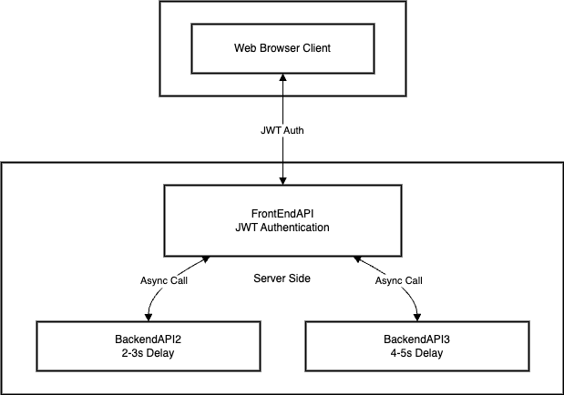
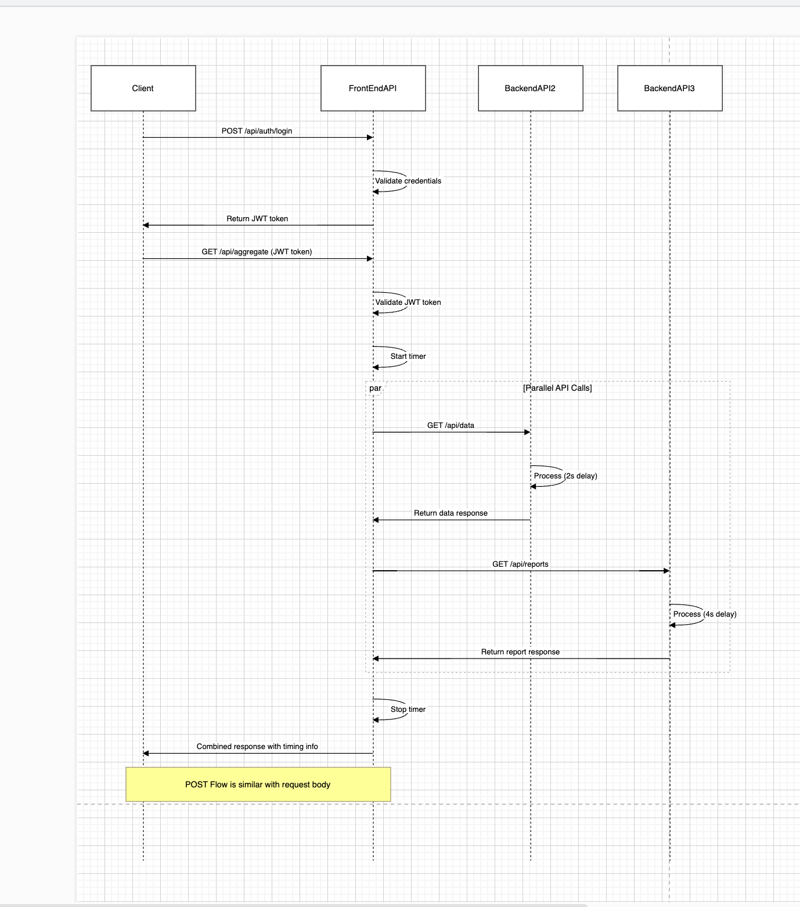

# APIBackgroundExample

# Asynchronous WebAPI Communication Example

This project demonstrates a three-tier WebAPI architecture with asynchronous communication between APIs. It consists of one front-end API that orchestrates calls to two back-end APIs, simulating a microservices architecture.

## Architecture Overview


### Components:

1. **FrontEndAPI**: Entry point API with JWT authentication that calls API2 and API3 asynchronously
2. **BackendAPI2**: Back-end API with artificial delay (2-3 seconds)
3. **BackendAPI3**: Back-end API with artificial delay (4-5 seconds)

## Features

- **Asynchronous API Communication**: Front-end API makes parallel calls to both back-end APIs
- **Artificial Delays**: Simulated processing times in the back-end APIs
- **JWT Authentication**: Secure access to the front-end API
- **GET/POST Support**: Both HTTP methods are supported across all APIs
- **Simple JavaScript UI**: Basic interface for testing the APIs

## Prerequisites

- Visual Studio 2022
- .NET 6.0 or later
- A modern web browser

## Setup Instructions

### 1. Clone the Repository

```bash
git clone https://github.com/yourusername/APIBackgroundExample.git
cd APIBackgroundExample
```

### 2. Open the Solution

Open the solution file (`APISampleGroup.sln`) in Visual Studio 2022.

### 3. Configure Multiple Startup Projects

1. Right-click on the solution in Solution Explorer
2. Select "Configure Startup Projects..."
3. Choose "Multiple startup projects"
4. Set all three projects to "Start"
5. Click OK

### 4. Update Configuration (if needed)

Each project has its own configuration in `appsettings.json`. The most important settings are:

**API1.FrontEnd**:
```json
"BackendServices": {
  "Api2Url": "https://localhost:7002",
  "Api3Url": "https://localhost:7003"
},
"Jwt": {
  "Key": "YourSuperSecretKey123!@#$%^&*()_ThisIsALongerKeyToMeetTheRequirement",
  "Issuer": "FrontEndAPI",
  "Audience": "api-clients"
}
```

### 5. Build and Run

1. Build the solution (Ctrl+Shift+B)
2. Start the application (F5 or the Run button)
3. All three APIs should start simultaneously

## Using the Application

1. When the application starts, your browser will open to `https://localhost:7001`
2. Login with one of the demo accounts:
   - Username: admin, Password: admin123
   - Username: user, Password: user123
3. After logging in, you can:
   - Click "Fetch Data" to make a GET request
   - Fill in the form and click "Submit Data" to make a POST request

## How It Works

### Flow Diagram



### Asynchronous Communication

When a request is made to API1:

1. API1 starts a timer
2. API1 simultaneously calls API2 and API3 (Task.WhenAll)
3. API1 waits for both responses
4. API1 combines the results and returns them with timing information
5. The total response time is determined by the slower of the two APIs

### Authentication Flow

1. User provides username/password
2. API1 validates credentials
3. API1 generates a JWT token
4. Client stores the token in localStorage
5. Token is sent with subsequent API requests
6. API1 validates the token before processing requests

## Project Structure

### API1.FrontEnd

- **Controllers**
  - `AuthController.cs`: Handles login requests
  - `AggregateController.cs`: Orchestrates calls to API2 and API3

- **Services**
  - `JwtService.cs`: Handles JWT token generation and validation
  - `BackendApiService.cs`: Manages communication with API2 and API3

- **Models**
  - Data transfer objects for requests and responses

- **wwwroot**
  - `index.html`: Simple UI for interacting with the APIs

### API2.BackEnd and API3.BackEnd

- **Controllers**
  - `DataController.cs` (API2): Handles data requests with 2-3 second delay
  - `ReportsController.cs` (API3): Handles report requests with 4-5 second delay

## Security Considerations

- JWT authentication uses HS256 algorithm
- Token expiration is set to 30 minutes
- HTTPS is used for all API communication
- CORS policies are configured for development
- In a production environment, additional security measures would be needed

## Enhancement Ideas

1. Add a database for user management
2. Implement refresh tokens
3. Add API rate limiting
4. Implement circuit breakers for API calls
5. Add comprehensive logging and monitoring
6. Containerize the application with Docker

## License

This project is licensed under the MIT License - see the LICENSE file for details.
